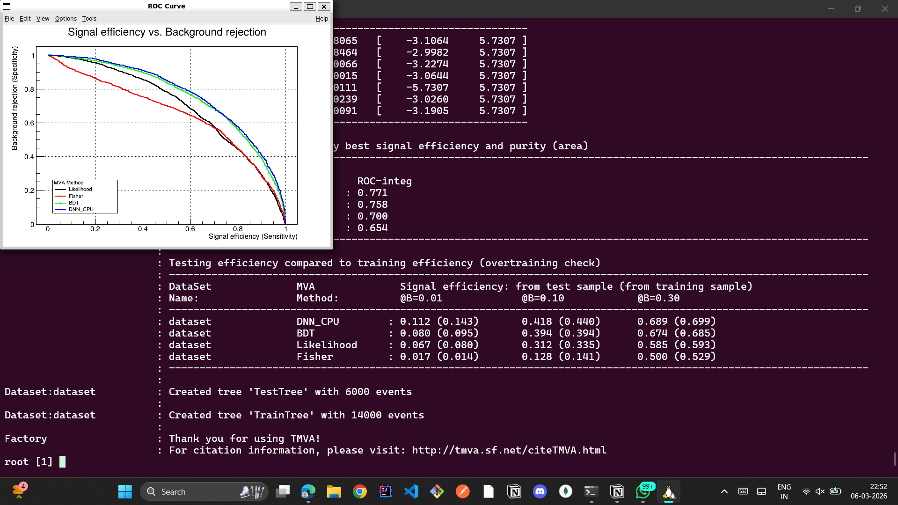

# GSoC 2026 - Exercise 2: TMVA Deep Learning Tutorials

## Overview
This document summarizes the results and observations from running the TMVA
deep learning tutorials as part of Exercise 2 for the GSoC 2026 SOFIE project.

---

## Tutorial 1: TMVA_CNN_Classification.C

This tutorial performs binary signal/background classification on 16x16 image
data using three methods: a Boosted Decision Tree (BDT), a Deep Neural Network
(DNN), and a Convolutional Neural Network (CNN).

The dataset consists of 1000 signal and 1000 background events, each
represented as a flattened 256-element vector of pixel values. 800 events per
class were used for training and 200 for testing.

The DNN used 4 dense layers of width 100 with ReLU activations and batch
normalisation, trained with the ADAM optimiser at a learning rate of 1e-3
for 10 epochs. The CNN used two convolutional layers with 10 filters of size
3x3 and batch normalisation, followed by a 2x2 max pooling layer, a reshape,
and two dense layers. The input layout was 1x16x16.

### Results

| Method       | ROC Integral | Signal Eff. @B=0.01  | Signal Eff. @B=0.10  |
|--------------|--------------|----------------------|----------------------|
| TMVA_CNN_CPU | 0.795        | 0.135 (train: 0.145) | 0.425 (train: 0.468) |
| BDT          | 0.762        | 0.115 (train: 0.332) | 0.325 (train: 0.677) |
| TMVA_DNN_CPU | 0.651        | 0.015 (train: 0.155) | 0.258 (train: 0.439) |

### ROC Curve

### Observations

The CNN achieved the best ROC integral of 0.795, which is expected since the
input data has spatial structure that convolutional layers are designed to
exploit. The BDT showed significant overtraining — at a background rejection
of 0.01, the training efficiency was 0.332 versus only 0.115 on the test set.
The DNN also overtrained noticeably. The CNN generalised best across all
working points, confirming that for image-like data CNNs outperform flat
classifiers like BDT and DNN.

---

## Tutorial 2: TMVA_Higgs_Classification.C

This tutorial performs Higgs boson signal/background classification using
7 high-level physics variables derived from jet and lepton kinematics.
10000 signal and 10000 background events were used, with 70% for training
and 30% for testing. Four methods were compared: Likelihood, Fisher
discriminant, BDT, and a Deep Neural Network.

The 7 input variables were m_jj, m_jjj, m_lv, m_jlv, m_bb, m_wbb and m_wwbb.
A Gaussian transformation was applied to the inputs before DNN training.

### Variable Importance

Across all methods m_bb consistently ranked as the most important variable
with the highest separation power of 0.091. This makes physical sense as the
invariant mass of the two b-jets is a strong discriminant for Higgs to bb
decay. The variables m_wwbb and m_wbb ranked second and third respectively.

### Results

| Method     | ROC Integral | Signal Eff. @B=0.01  | Signal Eff. @B=0.10  |
|------------|--------------|----------------------|----------------------|
| DNN_CPU    | 0.767        | 0.108 (train: 0.128) | 0.413 (train: 0.440) |
| BDT        | 0.758        | 0.080 (train: 0.095) | 0.394 (train: 0.394) |
| Likelihood | 0.700        | 0.067 (train: 0.080) | 0.312 (train: 0.335) |
| Fisher     | 0.654        | 0.017 (train: 0.014) | 0.128 (train: 0.141) |

### Observations

The DNN achieved the best performance with ROC 0.767, closely followed by
the BDT at 0.758. Unlike the CNN classification tutorial the BDT showed
minimal overtraining here — training and test efficiencies were nearly
identical, likely because the 7 tabular variables do not have the complex
structure that causes BDT memorisation. The Fisher discriminant performed
poorly since the variable correlations are non-linear and Fisher assumes
linear separability. The DNN with 4 TANH layers benefited from the Gaussian
variable transformation applied before training.

---

## Tutorial 3: TMVA_SOFIE_ONNX.C

This tutorial demonstrates SOFIE parsing of an ONNX model file. The model
parsed was Linear_16.onnx, a deep fully connected network with 10 layers.
The architecture is input (100) followed by 9 dense layers of width 50 with
ReLU activations and a final output layer of width 10. The model has 20
weight tensors in total.

SOFIE successfully parsed all 19 ONNX operators and generated a C++ inference
header. A key optimisation observed was operator fusion where each Gemm and
ReLU pair was fused into a single operation during parsing. SOFIE also used
a shared memory pool of only 6400 bytes for intermediate tensors by reusing
memory across layers, keeping the memory footprint minimal. The generated
code uses raw BLAS sgemm calls for matrix multiplication making inference
highly efficient on CPU.

---

## Tutorial 4: TMVA_SOFIE_Keras.py

This tutorial trains a Keras model and parses it with SOFIE via the Python
interface PyKeras. The model architecture was input (4) followed by Dense(32,
ReLU), Dense(16, ReLU), Dense(8, ReLU) and Dense(2, Softmax). Total trainable
parameters were 842. The model was trained for 3 epochs with cross-entropy
loss decreasing from 0.1136 to 0.1070.

SOFIE parsed the model and generated a C++ inference header using BLAS Gemm
calls. The inference output on a batch of 2 samples was:

    { 0.499285f, 0.500715f, 0.498719f, 0.501281f }

Each pair of values sums to approximately 1.0 confirming the Softmax output
is correct.

Two issues were encountered and resolved. First a CuDNN version mismatch
between runtime 9.1.0 and compiled 9.3.0 was fixed by setting
CUDA_VISIBLE_DEVICES=-1 to force CPU mode. Second a BLAS linking error with
an unresolved sgemm_ symbol was fixed by preloading OpenBLAS using
LD_PRELOAD=/usr/lib/x86_64-linux-gnu/libopenblas.so.

---

## Tutorial 5: TMVA_SOFIE_PyTorch.C

This tutorial trains a PyTorch model, saves it as a TorchScript file, and
parses it using the SOFIE C++ PyTorch parser. PyTorch version used was
2.5.1+cu121.

The model architecture was input (32) followed by Linear(16, ReLU) and
Linear(8, ReLU). It was saved as PyTorchModel.pt using torch.jit.script.

SOFIE parsed the TorchScript model and correctly identified all 4 weight
tensors: 0.weight of shape 16x32, 0.bias of shape 16, 2.weight of shape 8x16
and 2.bias of shape 8. The generated C++ header uses fused Gemm and ReLU
operators with a shared memory pool of 256 bytes for intermediate tensors.

---

## Summary

All five tutorials ran successfully. CNNs outperform flat classifiers on
spatially structured image data. The variable m_bb is the most discriminating
feature in Higgs classification across all methods. SOFIE can parse models
from ONNX, Keras and PyTorch formats and generates optimised C++ inference
code with BLAS acceleration, operator fusion and minimal memory pooling.
